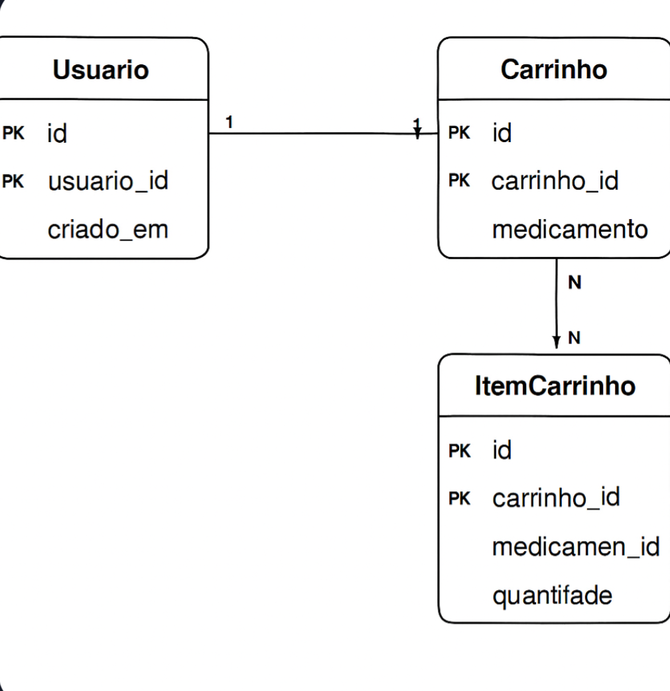
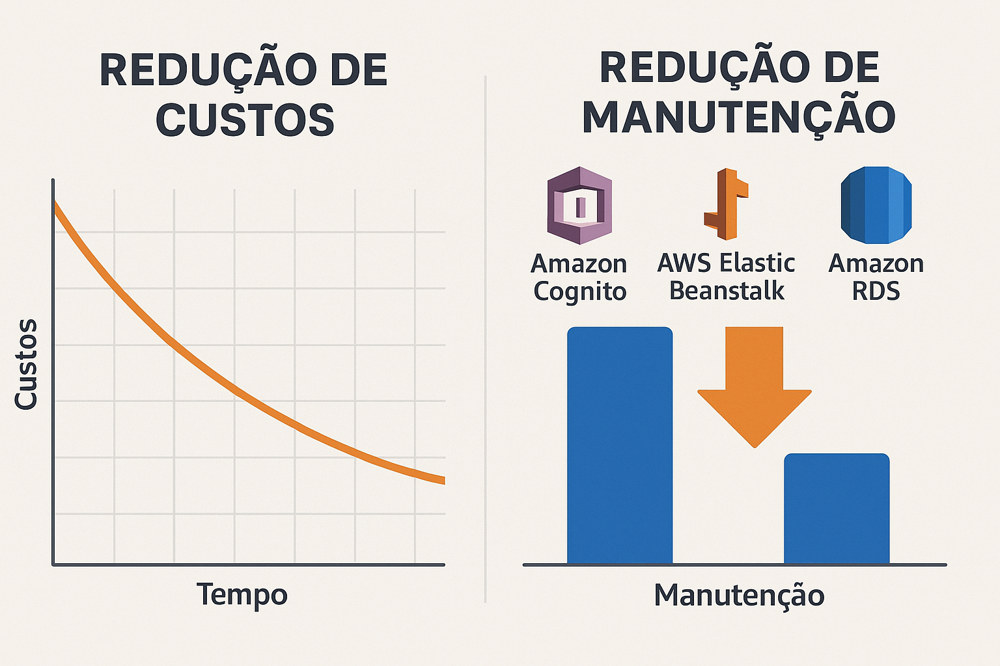

# Apresentação do Projeto: Modernização da "Plataforma Virtual" com AWS

**Data_Inicio:** 12/12/2025  
**Empresa:** Abstergo Industries  
**Responsável:** Pedro Zeferino da Silva

---

## 1. Introdução

Este projeto apresenta a modernização da aplicação "Plataforma Virtual" da Abstergo Industries, a partir da migração de sua infraestrutura para a nuvem AWS. Foram elencados 3 serviços principais – **Cognito, Elastic Beanstalk e RDS** – com a finalidade de realizar uma significativa **redução de custos imediatos** e fortalecer a **segurança dos dados**.

---

## 2. Arquitetura e Serviços Selecionados

A arquitetura baseia-se em uma aplicação **Java Spring Boot** conforme  ./), integrada aos seguintes serviços gerenciados:

1. **Amazon Cognito:** Gerenciamento de autenticação e identidade.
2. **AWS Elastic Beanstalk:** Orquestração de deploy e escalabilidade automática.
3. **Amazon RDS:** Banco de dados relacional gerenciado.

---

## 3. Conformidade com Padrões e Normas

A escolha destes três serviços não foi baseada apenas em custo, mas também na aderência a rígidos padrões de segurança e normas da indústria, essenciais para o comércio de **medicamentos**:

- **Segurança de Dados (LGPD/GDPR):** O **Amazon RDS** e o **Amazon Cognito** garantem a proteção de dados sensíveis, com criptografia e conformidade com padrões globais (SOC, PCI DSS, ISO 27001).
- **Padrões de Alta Disponibilidade (SLA):** O **AWS Elastic Beanstalk** garante a consistência do ambiente, reduzindo falhas humanas no deploy.

---

## 4. Benefícios Financeiros e Operacionais

- **Redução de OpEx:** Substituição de custos fixos de servidores por um modelo "pague pelo que usar".
- **Elasticidade:** Ajuste automático da capacidade conforme a demanda, evitando gastos com ociosidade ou sobrecarga.

---

## 5. Comparativo de Cenários: On-Premise vs. AWS Cloud

A análise comparativa justifica a migração, mostrando a vantagem do modelo flexível da AWS em relação à rigidez do ambiente legado.

A tabela abaixo demonstra a redução de custos operacionais (TCO) projetada, **resultando em uma economia de aproximadamente 75%**.

| **Categoria de Custo** | **Antes (On-Premise)** | **Depois (AWS Cloud)** |
| :--- | :--- | :--- |
| **Computação** | R$ 1.500,00 | R$ 450,00 |
| **Banco de Dados** | R$ 800,00 | R$ 350,00 |
| **Mão de Obra (Ops)** | R$ 2.000,00 | R$ 500,00 |
| **Energia/Cooling** | R$ 300,00 | R$ 0,00 |
| **Segurança/Auth** | R$ 600,00 | R$ 0,00 (Free Tier) |
| **TOTAL MENSAL** | **R$ 5.200,00** | **R$ 1.300,00** |

---

## 6. Como Contribuir

Para informações detalhadas sobre a arquitetura do código, como configurar o ambiente de desenvolvimento e contribuir com o projeto, consulte o nosso **[Guia de Contribuição](CONTRIBUTING.md)**.

---

## 7. Considerações Finais

A implementação desta arquitetura de nuvem na Abstergo Industries promove uma infraestrutura robusta, segura, econômica e escalável. A utilização combinada de **Cognito, Elastic Beanstalk e RDS** garante que a empresa foque no negócio e não na manutenção de hardware.

### 📚 Referências Oficiais AWS

- [Amazon Web Services](https://aws.amazon.com/pt/free/)
- [Amazon Cognito](https://aws.amazon.com/pt/cognito/)
- [AWS Elastic Beanstalk](https://aws.amazon.com/pt/elasticbeanstalk/)
- [Amazon RDS](https://aws.amazon.com/pt/rds/)

---

**Data_Final:** 14/12/2025  
**Empresa:** Abstergo Industries  
**Responsável:** Pedro Zeferino da Silva
